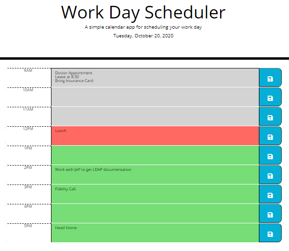

# Day-Scheduler

This day scheduler app allows the user to keep up with their schedule for the day.

## Description
The application allows the user to save events for each hour of the day.  

## Logic Requirements
* When the planner is opened, the current day is displayed at the top of the calendar.
* When the user scrolls down, timeblocks will be presented for standard business hours (9am to 5pm).
* When an event is entered, the timeblock will be save by clicking the save button in local storage.
* When the page is refreshed, the saved events will persist.

## Built with
* HTML
* CSS
* Javascript and jQuery
* [Moment.js](momentjs.com/)
* [Font Awesome Icon](fontawesome.com)
* [Visual Studio Code](code.visualstudio.com)

## Website
https://drclever.github.io/Day-Scheduler

## Random Password Generator Image
